# V-Tech Shop App - Mobile Application

## 📱 Giới thiệu

**V-Tech Shop** là ứng dụng di động được phát triển bằng **Kotlin Compose** trên nền tảng **Android** kết hợp với hệ thống backend được xây dựng bằng **Node.js** và cơ sở dữ liệu **MongoDB**, ứng dụng được thiết kế và phát triển dành riêng cho **V-Tech Shop** – một cửa hàng chuyên cung cấp các sản phẩm công nghệ như điện thoại, laptop, phụ kiện điện tử, v.v. Dự án hướng đến việc tạo ra một nền tảng mua sắm các sản phẩm công nghệ tiện lợi, hiện đại, thân thiện với người dùng và dễ dàng mở rộng, với đầy đủ các tính năng thiết yếu của một hệ thống ứng dụng mua sắm online.

## 🌟 Tính năng chính
- Đăng nhập/Đăng ký tài khoản
- Duyệt danh mục sản phẩm công nghệ
- Tìm kiếm và lọc sản phẩm
- Giỏ hàng và thanh toán
- Theo dõi đơn hàng
- Đánh giá sản phẩm
- Quản lý thông tin cá nhân

## Ảnh chụp giao diện ứng dụng
<table>
  <tr>
    <td>Trang chủ/ danh sách sản phẩm</td>
    <td>Tìm kiếm</td>
    <td>Danh mục sản phẩm</td>
    <td>Chi tiết sản phẩm</td>
  </tr>
  <tr>
    <td>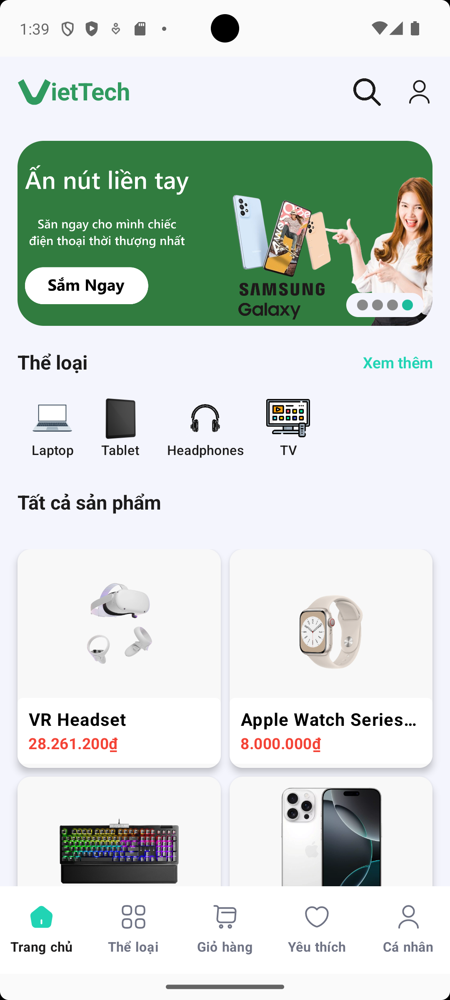</td>
    <td>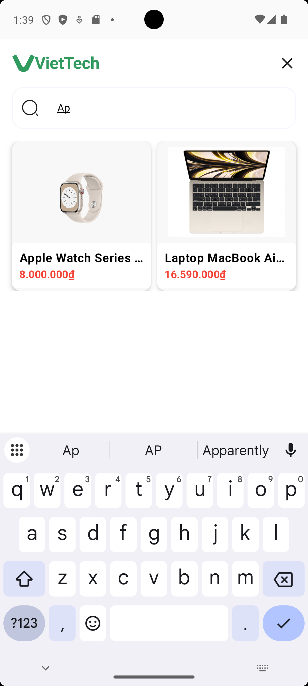</td>
    <td>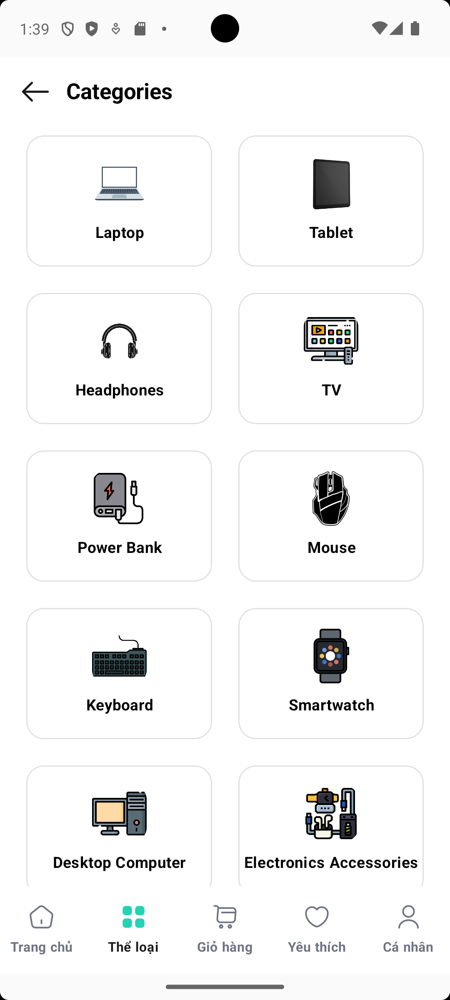</td>
    <td></td>
  </tr>
  <tr>
    <td colspan="4"></td>
  </tr>
  <tr>
    <td>Thêm vào giỏ hàng</td>
    <td>Giỏ hàng</td>
    <td>Chọn mã giảm giá</td>
    <td>Thanh toán</td>
  </tr>
  <tr>
    <td>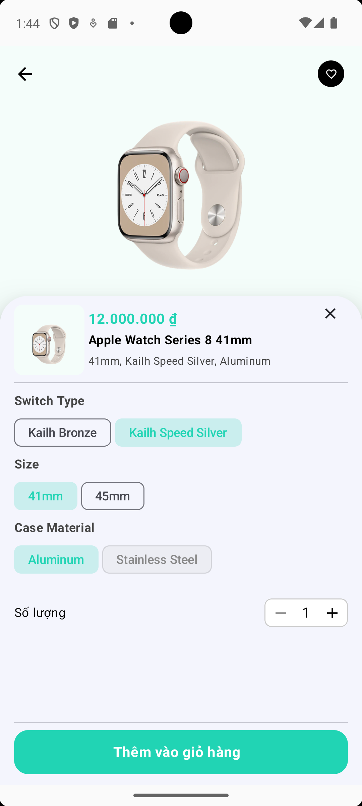</td>
    <td>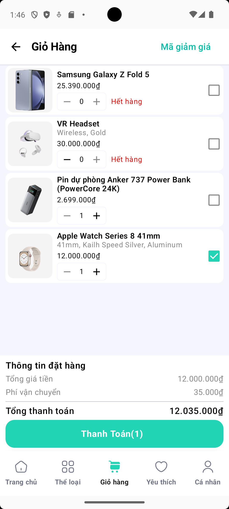</td>
    <td>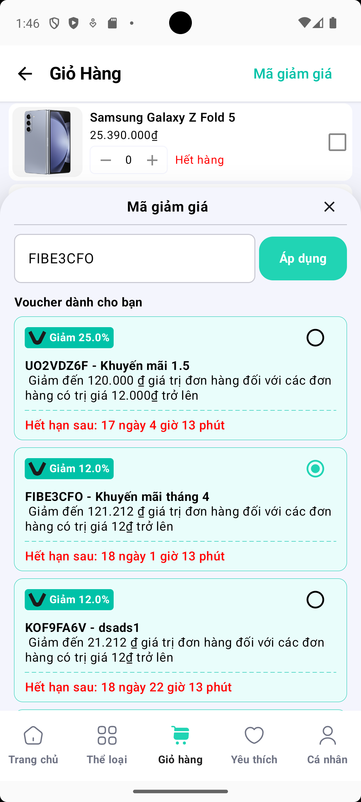</td>
    <td>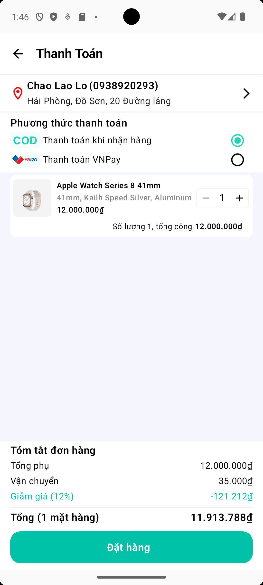</td>
  </tr>
  </table>
  <table>
  <tr>
    <td>Thanh toán thành công</td>
    <td>Lịch sử đơn hàng - đang chờ</td>
    <td>Lịch sử đơn hàng - thành công</td>
  </tr>
  <tr>
    <td>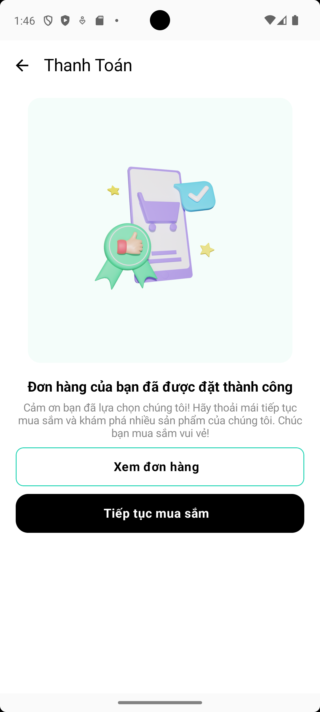</td>
    <td>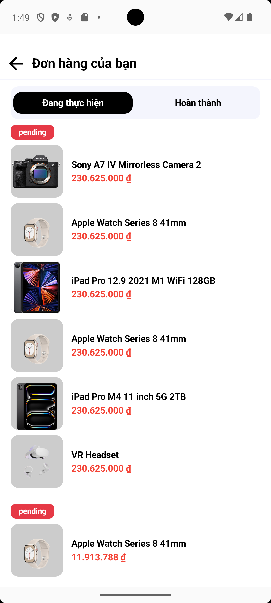</td>
    <td>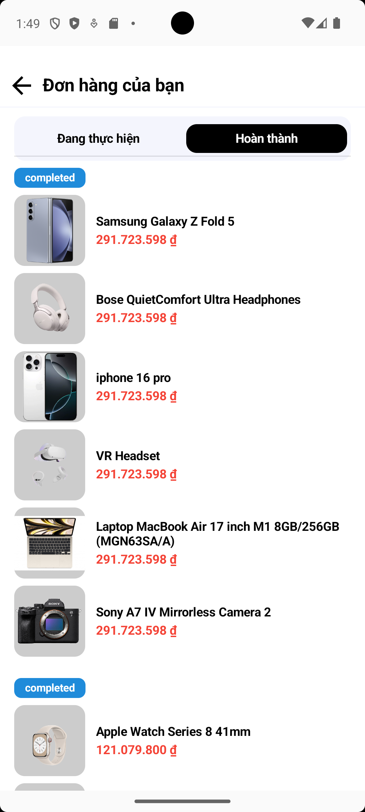</td>
  </tr>
  <tr>
    <td colspan="3"></td>
  </tr>
  <tr>
    <td>Yêu thích</td>
    <td>Trang cá nhân</td>
    <td>Thiết lập địa chỉ</td>
  </tr>
  <tr>
    <td>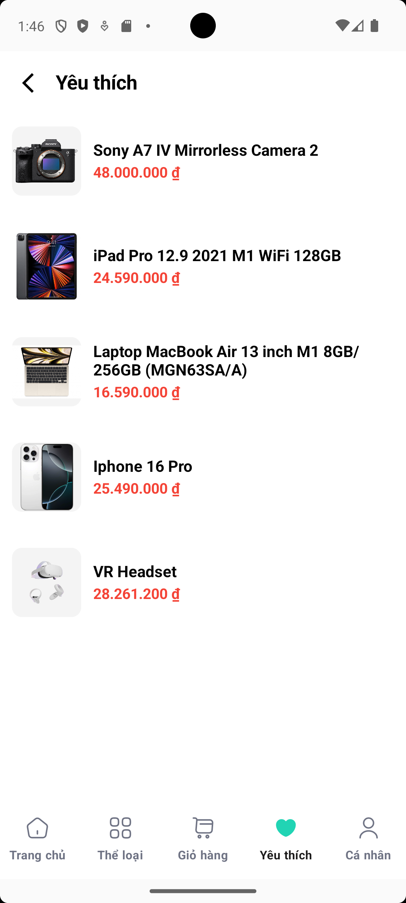</td>
    <td>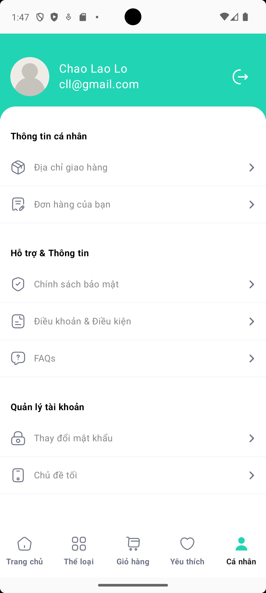</td>
    <td>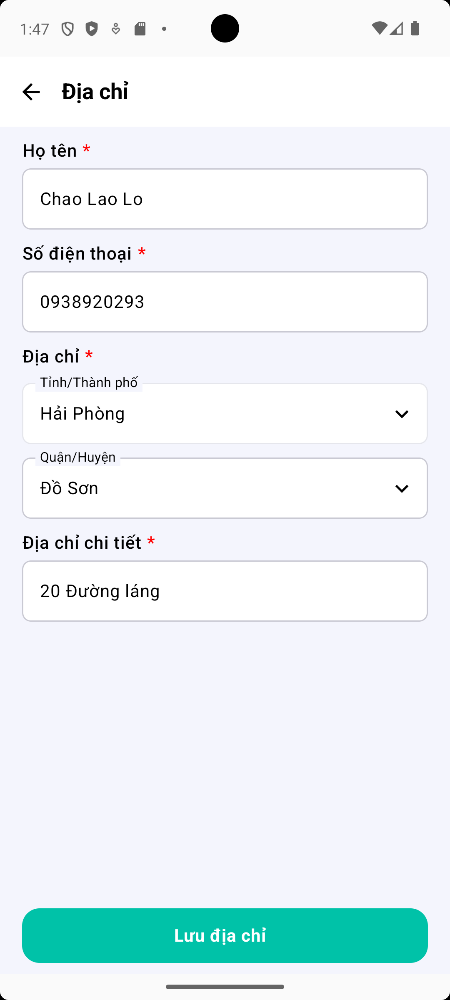</td>
  </tr>
  <tr>
    <td colspan="3"></td>
  </tr>
  <tr>
    <td>Đăng ký</td>
    <td>Đăng nhập</td>
    <td>Đổi mật khẩu</td>
  </tr>
  <tr>
    <td>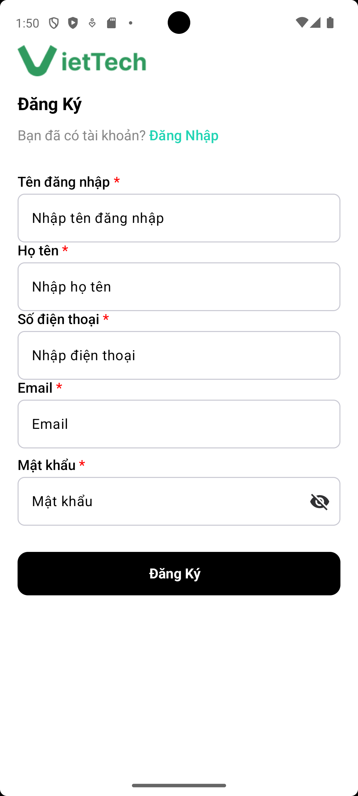</td>
    <td>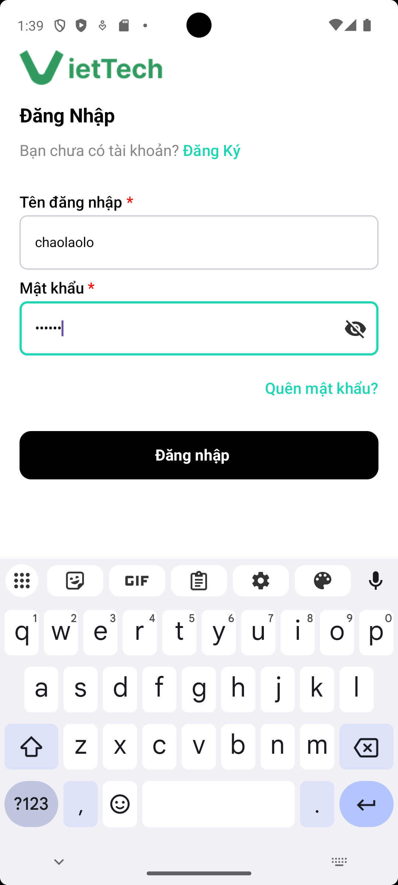</td>
    <td></td>
  </tr>
  <tr>
    <td colspan="3"></td>
  </tr>
</table>
  
## 🛠 Công nghệ sử dụng

### Frontend (Android App)
- **Ngôn ngữ**: Kotlin
- **Framework**: Jetpack Compose
- **Architecture**: MVVM (Model-View-ViewModel)
- **Thư viện chính**:
  - Retrofit: Kết nối API backend
  - Coil: Load và cache hình ảnh
  - Navigation Compose: Điều hướng trong app
  - Hilt: Dependency Injection
  - Coroutines & Flow: Xử lý bất đồng bộ
  - LottieFiles: Hiệu ứng động

### Backend
- **Ngôn ngữ**: Node.js
- **Cơ sở dữ liệu**: MongoDB
- **API Documentation**: Postman

### Công cụ hỗ trợ
- **Thiết kế UI/UX**: Figma
- **Vẽ sơ đồ hệ thống**: Draw.io
- **IDE**: Android Studio
- **Version Control**: Git/GitHub


## 🚀 Cài đặt và chạy ứng dụng

### Yêu cầu hệ thống
- Android Studio Flamingo hoặc mới hơn
- Android SDK 33+
- JDK 17+

### Các bước cài đặt
1. Clone repository:
   ```bash
   git clone https://github.com/chaolaolo/v_tech_shop_app.git
   ```
2. Mở project bằng Android Studio
3. Đồng bộ Gradle và tải các dependencies
4. Tạo file `local.properties` nếu chưa có và thêm:
   ```properties
   sdk.dir=/path/to/your/android/sdk
   ```
5. Chạy ứng dụng trên máy ảo hoặc thiết bị thật

**Liên hệ với tôi**: 
- Chảo Láo Lở - [chaolaolo290604@gmail.com](mailto:chaolaolo290604@gmail.com).

© 2025 V-Tech Shop Team
